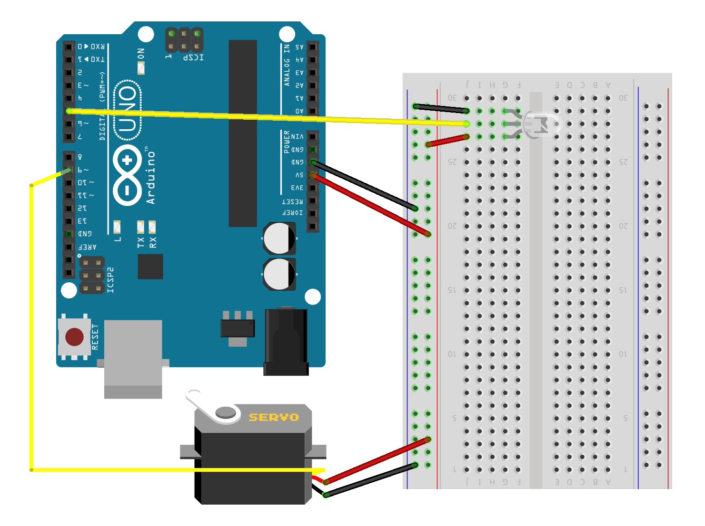

# ghost-cubes

## Circuit:

## Interaction types:

### Left hand
1. Palm down -> music starts
2. Palm up -> music stops

### Right hand
1. Height -> LEDs' colour changes -> Music volume changes
2. Rotation -> Cubes rotate -> Music frequency changes
